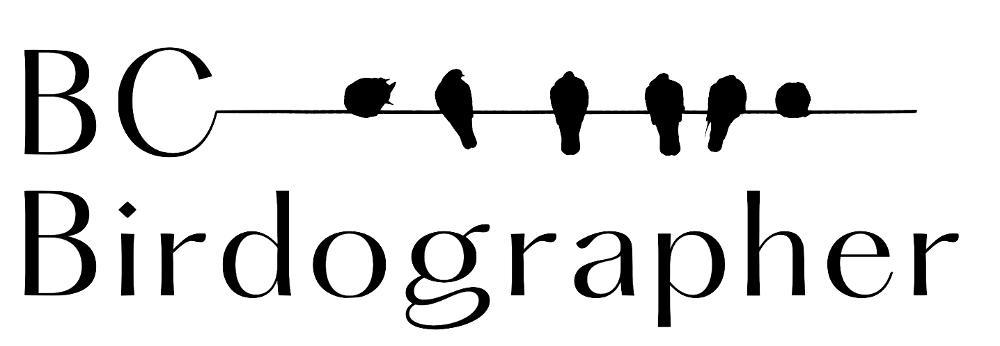

    

          <li>

              <ul class='nested'>
                  <li>Diving Birds
                    <ul class='nested'>
                      <li>Brandt's Cormorant</li>
                    </ul>
                  </li>
                  <li>Seabirds
                  <li>Gull-like Birds
                  <li>Waterfowl
                  <li>Wading Birds
                  <li>Shore Birds
                  <li>Grouse-like Birds
                  <li>Birds of Prey
                  <li>Doves, Nighthawks & Kingfishers
                  <li>Swifts, Swallows & Hummingbirds
                  <li>Woodpeckers
                  <li>Flycatchers
                  <li>Larks, Wrens, Waxwings, Starlings
                  <li>Jays & Crows
                  <li>Chickadees & Nuthatches
                  <li>Thrushes
                  <li>Vireos & Warblers
                  <li>Blackbirds & Tanagers
                  <li>Sparrows
                  <li>Finch-like Birds
                      <ul class='nested'>
                          <li>Grand Child
                              <ul class='nested'>
                                  <li>Great Grand Child</li>
                              </ul>
                          </li>
                      </ul>
                  </li>
              </ul>
    

